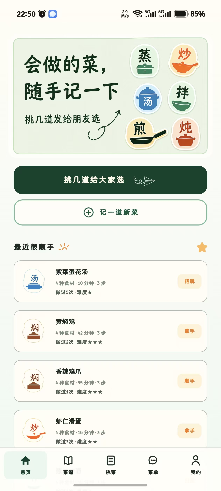
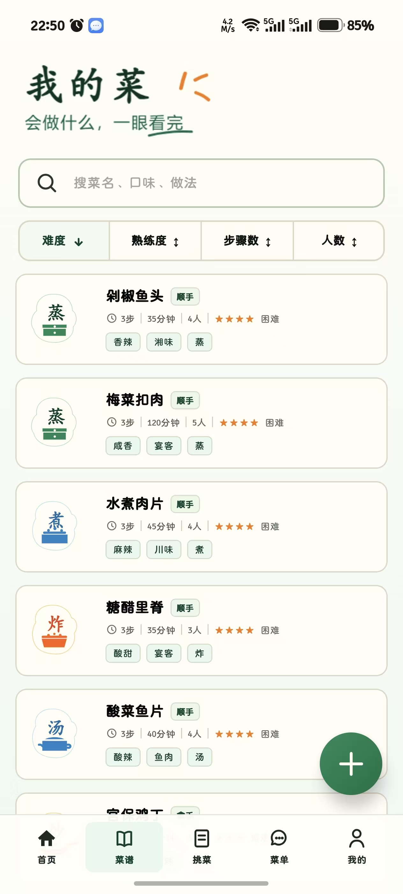
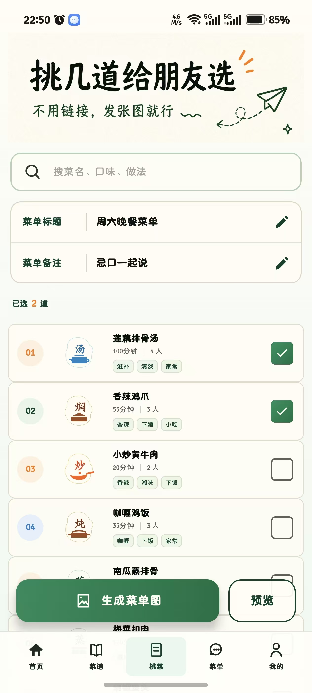
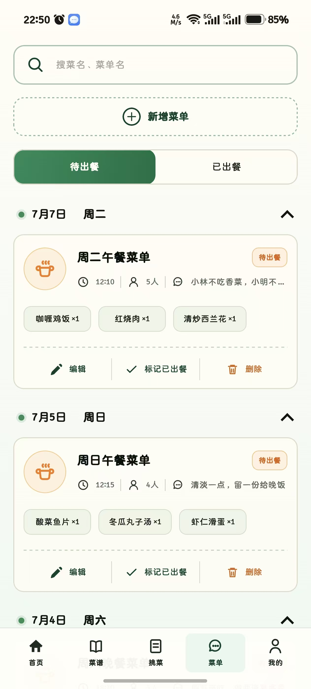

# SignatureMenuApp

SignatureMenu（招牌菜单）是一款面向家庭与朋友聚餐场景的离线 Android 菜谱、选菜和菜单管理应用。它把“我会做什么”“这次吃什么”和“以前做过什么”集中在一个轻量的本地工具中：平时随手记录菜谱，需要聚餐时快速挑选菜品、生成菜单，并持续沉淀自己的拿手菜清单。

应用采用温暖的纸张底色、手写风标题和烹饪方式贴纸，围绕“会做的菜，随手记一下；挑几道，给朋友选”的使用体验设计。

## 界面预览

| 首页 | 菜谱 |
| --- | --- |
|  |  |
| **挑菜** | **菜单** |
|  |  |

## 主要功能

- **首页概览**：快捷进入“挑菜”和“新增菜谱”，并展示近期做得顺手的菜。
- **菜谱管理**：新增、编辑、查看和删除菜谱，记录用料、步骤、烹饪方式、人数、耗时、难度、口味标签与熟练度。
- **搜索与排序**：按菜名、口味或做法搜索，并按难度、熟练度、步骤数和人数整理菜谱。
- **快速挑菜**：从可用菜谱中多选菜品，填写菜单标题与备注，预览后保存为菜单。
- **菜单归档**：按待出餐和已出餐查看菜单，支持编辑、删除及状态切换；出餐状态会同步更新菜谱的制作次数。
- **本地数据管理**：数据保存在设备本地，无需登录或联网；支持通过 JSON 文件导出备份和追加导入。

## 技术栈

- Kotlin 2.2.10
- Jetpack Compose + Material 3
- Android Gradle Plugin 9.2.1
- Android SDK 36.1（`minSdk 36` / `targetSdk 36`）
- 本地 JSON 文件持久化

## 项目结构

```text
SignatureMenuApp/
├── app/src/main/java/com/example/signaturemenuapp/
│   ├── data/              # 数据模型、本地存储及导入导出
│   ├── ui/components/     # 通用 Compose 组件
│   ├── ui/screens/        # 首页、菜谱、挑菜、菜单和设置页面
│   └── MainActivity.kt    # 应用入口
├── app/src/main/res/      # 图标、插画、主题等 Android 资源
├── app/src/main/assets/   # 应用内使用的视觉素材
└── assets/                # README 展示截图
```

## 本地运行

1. 使用支持 Android Gradle Plugin 9.2.1 的 Android Studio 打开本目录。
2. 安装 Android SDK 36.1，并等待 Gradle 同步完成。
3. 连接 Android 设备或启动 API 36 及以上的模拟器。
4. 选择 `app` 配置并运行。

也可以在项目目录执行命令生成 Debug APK：

```powershell
.\gradlew.bat assembleDebug
```

构建产物位于 `app/build/outputs/apk/debug/`。

## 数据说明

应用首次启动会写入示例菜谱和菜单。后续数据存储在应用私有目录的 `signature_menu_data.json` 中；卸载应用可能清除这些数据，建议在“我的”页面定期导出 JSON 备份。导入采用追加模式，不会覆盖当前已有数据。
